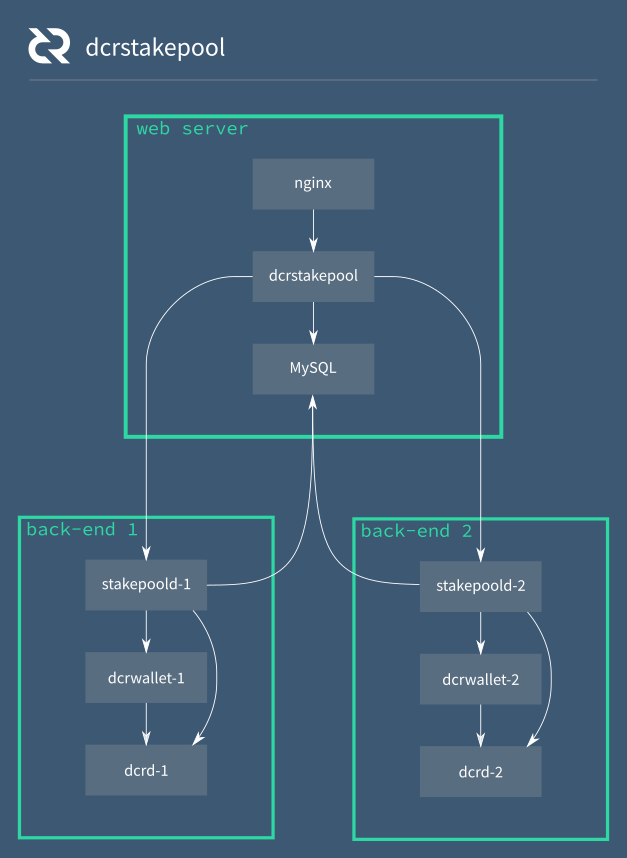

# dcrstakepool

[](https://godoc.org/github.com/decred/dcrstakepool)
[](https://github.com/decred/dcrstakepool/actions)
[](https://goreportcard.com/report/github.com/decred/dcrstakepool)

dcrstakepool is a web application which coordinates generating 1-of-2 multisig
addresses on a pool of [dcrwallet](https://github.com/decred/dcrwallet) servers
so users can purchase [proof-of-stake tickets](https://docs.decred.org/mining/proof-of-stake/)
on the [Decred](https://decred.org/) network and have the pool of wallet servers
vote on their behalf when the ticket is selected.

**NB:** In late 2018, [a proposal](https://proposals.decred.org/proposals/522652954ea7998f3fca95b9c4ca8907820eb785877dcf7fba92307131818c75)
was approved by stakeholders to rename "Stakepool" to "Voting Service Provider", a.k.a. "VSP".
These names are used interchangably in this repository.


## Architecture



- It is highly recommended to use at least 2 dcrd+dcrwallet+stakepoold
  nodes (backend servers) for production use on mainnet.
  One backend server can be used on testnet.
- Running dcrstakepool on mainnet is documented further at
  [https://docs.decred.org](https://docs.decred.org/advanced/operating-a-vsp/).
- The architecture is subject to change in the future to lessen the dependence
  on MySQL.


## Test Harness

A test harness is provided in `./harness.sh`. The test harness uses tmux to start
a dcrd node, multiple dcrwallet and stakepoold instances, and finally a dcrstakepool
instance. It uses hard-coded wallet seeds and pubkeys, and as a result it is only
suitable for use on testnet. Further documentation can be found in `./harness.sh`.


## Requirements

- [Go](https://golang.org) 1.12 or newer (1.13 is recommended).
- MySQL
- Nginx or other web server to proxy to dcrstakepool


## Installation

### Build from source

Building or updating from source requires the following build dependencies:

- **Go 1.12 or 1.13**

Building or updating from source requires only an installation of Go
([instructions](https://golang.org/doc/install)). It is recommended to add
`$GOPATH/bin` to your `PATH` at this point.

To build and install from a checked-out repo, run `go install . ./backend/stakepoold`
in the repo's root directory.

* Set the `GO111MODULE=on` environment variable if building from within
  `GOPATH`.


## Updating

Please defer to the 1.2.0 [release notes](docs/release-note-1.2.0.md/#recommended-upgrade-path).


## Setup

### Pre-requisites

These instructions assume you are familiar with dcrd/dcrwallet.

- Create basic dcrd/dcrwallet/dcrctl config files with usernames, passwords,
  rpclisten, and network set appropriately within them or run example commands
  with additional flags as necessary.

- Build/install dcrd and dcrwallet from latest master.

- Run dcrd instances and let them fully sync.


### Voting service fees/cold wallet

- Setup a new wallet for receiving payment for voting service fees.  **This should
  be completely separate from the voting service infrastructure.**
- From your local machine...

```bash
$ dcrwallet --create
$ dcrwallet
```

- Get the master pubkey for the account you wish to use. This will be needed to
  configure dcrwallet and dcrstakepool.

```bash
$ dcrctl --wallet createnewaccount stakepoolfees
$ dcrctl --wallet getmasterpubkey stakepoolfees
```

- Mark 10000 addresses in use for the account so the wallet will recognize
  transactions to those addresses. Fees from UserId 1 will go to address 1,
  UserId 2 to address 2, and so on.

```bash
$ dcrctl --wallet accountsyncaddressindex teststakepoolfees 0 10000
```

### Voting service voting wallets

- Create the wallets.  All wallets should have the same seed.  **Backup the seed
  for disaster recovery!**
- Log into wallet servers separately and create wallets one at a time using the
  same seed.

```bash
$ ssh walletserver1
$ dcrwallet --create
```

- Start a properly configured dcrwallet and unlock it. See
  sample-dcrwallet.conf.
- From your local machine...

```bash
$ cp sample-dcrwallet.conf dcrwallet.conf
$ vim dcrwallet.conf
$ scp dcrwallet.conf walletserver1:~/.dcrwallet/
$ ssh walletserver1
$ dcrwallet
```

- Get the master pubkey from the default account.  This will be used for
  votingwalletextpub in dcrstakepool.conf.

```bash
$ ssh walletserver1
$ dcrctl --wallet getmasterpubkey default
```

### MySQL

- Log into your frontend
- Install, configure, and start MySQL
- Add stakepool user and create the stakepool database

```bash
$ ssh frontendserver
$ mysql -uroot -p

MySQL> CREATE USER 'stakepool'@'localhost' IDENTIFIED BY 'password';
MySQL> GRANT ALL PRIVILEGES ON *.* TO 'stakepool'@'localhost' WITH GRANT OPTION;
MySQL> FLUSH PRIVILEGES;
MySQL> CREATE DATABASE stakepool;
```

### Nginx/web server

- Adapt sample-nginx.conf or setup a different web server in a proxy
  configuration. To prepare pre-zipped files to save the reverse proxy the
  trouble of compressing data on-the-fly, see the zipassets.sh script.


### stakepoold setup

- Copy sample config and edit appropriately.
- From your local machine...

```bash
$ mkdir .stakepoold
$ cp sample-stakepoold.conf .stakepoold/stakepoold.conf
$ vim .stakepoold/stakepoold.conf
$ scp -r .stakepoold walletserver1:~/
$ scp -r .stakepoold walletserver2:~/
```

- Build and copy the stakepoold executable to each wallet server.
- From your local machine...

```bash
$ cd backend/stakepoold/
$ go build
$ scp stakepoold walletserver1:~/
$ scp stakepoold walletserver2:~/
```

### dcrstakepool setup

- Create the .dcrstakepool directory and copy dcrwallet certs to it:

```bash
$ ssh frontendserver
$ mkdir ~/.dcrstakepool
$ cd ~/.dcrstakepool
$ scp walletserver1:~/.dcrwallet/rpc.cert wallet1.cert
$ scp walletserver2:~/.dcrwallet/rpc.cert wallet2.cert
$ scp walletserver1:~/.stakepoold/rpc.cert stakepoold1.cert
$ scp walletserver2:~/.stakepoold/rpc.cert stakepoold2.cert
```

- Copy sample config and edit appropriately.
- From your local machine...

```bash
$ cp sample-dcrstakepool.conf dcrstakepool.conf
$ vim dcrstakepool.conf
$ scp dcrstakepool.conf frontendserver:~/.dcrstakepool/
```
- Build and copy the entire dcrstakepool folder to your frontend.
- From your local machine...

```bash
$ go build
$ scp -r ../dcrstakepool frontendserver:~/
```

## Running

### stakepoold

Log into all servers and run stakepoold one at a time.

```bash
$ ssh walletserver1
$ ./stakepoold
```

### dcrstakepool

Log into your frontend and run dcrstakepool

```bash
$ ssh frontendserver
$ cd dcrstakepool
$ ./dcrstakepool
```
To run `dcrstakepool` from another folder, such as `/opt/dcrstakepool`, it is
necessary to copy (1) the `dcrstakepool` executable generated by `go build`, (2)
the `public` folder, and (3) the `views` folder into the other folder.

By default, `dcrstakepool` looks for the `public` and `views` folders in the
same parent directory as the `dcrstakepool` executable. If you wish to run
dcrstakepool from a different directory you will need to change **publicpath**
and **templatepath** from their relative paths to an absolute path.

## Development

If you are modifying templates, sending the USR1 signal to the dcrstakepool
process will trigger a template reload.

### Protoc

In order to regenerate the api.pb.go file, for the gRPC connection with
stakepoold, the following are required:

- libprotoc 3.0.0 (3.4.0 is recommended)
- protoc-gen-go 1.3.0 (1.3.2 is recommended)

## Operations

- dcrstakepool will connect to the database or error out if it cannot do so.

- dcrstakepool will create the stakepool.Users table automatically if it doesn't
  exist.

- dcrstakepool attempts to connect to all of the stakepoold servers on startup or
  error out if it cannot do so.

- dcrstakepool takes a user's pubkey, validates it, calls getnewaddress on all
  the wallet servers, then createmultisig, and finally importscript.  If any of
  these RPCs fail or returns inconsistent results, the RPC client built-in to
  dcrstakepool will shut down and will not operate until it has been restarted.
  Wallets should be verified to be in sync before restarting.

- User API Tokens have an issuer field set to baseURL from the configuration file.
  Changing the baseURL requires all API Tokens to be re-generated.

## Adding Invalid Tickets

### For Newer versions / git tip

If a user pays an incorrect fee, login as an account that meets the
adminUserIps and adminUserIds restrictions and click the 'Add Low Fee Tickets'
link in the menu.  You will be presented with a list of tickets that are
suitable for adding.  Check the appropriate one(s) and click the submit button.
Upon success, you should see the stakepoold logs reflect that the new tickets
were processed.

### For v1.1.1 and below

If a user pays an incorrect fee you may add their tickets like so (requires dcrd
running with `txindex=1`):

```bash
dcrctl --wallet stakepooluserinfo "MultiSigAddress" | grep -Pzo '(?<="invalid": \[)[^\]]*' | tr -d , | xargs -Itickethash dcrctl --wallet getrawtransaction tickethash | xargs -Itickethex dcrctl --wallet addticket "tickethex"
```

## Backups, monitoring, security considerations

- MySQL should be backed up often and regularly (probably at least hourly).
  Backups should be transferred off-site.  If using binary backups, do a test
  restore. For .sql files, verify visually.

- A monitoring system with alerting should be pointed at dcrstakepool and
  tested/verified to be operating properly.  There is a hidden /status page
  which throws 500 if the RPC client is shutdown.  If your monitoring system
  supports it, add additional points of verification such as: checking that the
  /stats page loads and has expected information in it, create a test account
  and setup automated login testing, etc.

- Wallets should never be used for anything else (they should always have a
  balance of 0).

## Disaster Recovery

**Always keep at least one wallet voting while performing maintenance / restoration!**

- In the case of a total failure of a wallet server:
  - Restore the failed wallet(s) from seed.
  - Restart the dcrstakepool process to allow automatic syncing to occur.

## Getting help

To get help with `dcrstakepool` please create a
[GitHub issue](https://github.com/decred/dcrstakepool/issues)
or the join the [Decred community](https://decred.org/community/)
using your preferred chat platform.

## License

dcrstakepool is licensed under the [copyfree](http://copyfree.org) MIT/X11 and
ISC Licenses.
