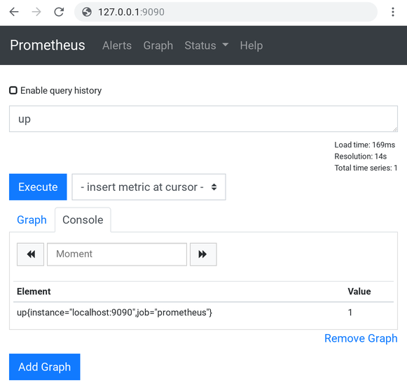
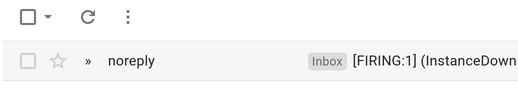

## Prometheus Quickstart
A voting service provider (VSP) facilitates user participation blockchain governance, so [reliability](https://landing.google.com/sre/sre-book/chapters/introduction/) is paramount.  The purpose of this guide is to briefly demonstrate how a VSP operator can use [Prometheus](https://prometheus.io/) to monitor `stakepoold` node health.   Prometheus provides a time series database with a query language, along with an `alertmanager` that aggregates and deduplicates alerts.  Prometheus is multi-platform and supports various notification methods. The follow-up article [prometheus-examples.md](prometheus-examples.md) provides samples for detecting transient voting wallet errors, sending alerts by mobile push notifications, and setting up system services for a permanent deployment.  Prometheus metrics are widely supported, so it is also possible to consume `stakepoold` metrics using other software such as Sensu+Influxdb.

This guide uses Linux (Debian Stretch, not that it matters too much).  If you aren't comfortable using tmux or screen, multiple concurrent ssh sessions will be necessary. This is written for VSP operators, so it is assumed the reader has basic sysadmin skills like creating and editing plain text configuration files.  In the event that the instructions here fail you for any reason (sorry), you are advised to skip to the Further Reading section below and the official documentation.  Prometheus is an open source project, so it changes quite rapidly and this guide may not always be up to date.

Let’s start.

You can export some relevant metrics from stakepoold by using the `--prometheus` flag or just by adding `prometheus=1` in your `stakepoold.conf`. You should be able to see stakepoold listening on a new port (default: 9101) e.g. `netstat -tnp | grep stakepoold`. When enabled, you should be able to connect to and see metrics for your local node:

```
$ curl http://localhost:9101
# HELP dcr_block_height Returns the latest block height
# TYPE dcr_block_height gauge
dcr_block_height 268862
# HELP dcr_peer_connections Returns a count of connections from peers
# TYPE dcr_peer_connections gauge
dcr_peer_connections 23
# HELP dcr_tickets_live Returns a count of live tickets
# TYPE dcr_tickets_live gauge
dcr_tickets_live 42
# HELP dcr_tickets_missed Returns a count of missed tickets
# TYPE dcr_tickets_missed gauge
dcr_tickets_missed 4
```
Ensure that your iptables policies don’t allow public access to your metrics. You are encouraged to set up a TLS reverse proxy with HTTP authentication to lock it down even more.  Finally, there are two other related configuration parameters:
 - `prometheuslisten` - The default is port 9101, but feel free to change it.
 - `prometheuswait` - The default is one minute. Every metric update requires rpc calls to dcrd and dcrwallet, so avoid setting this to a low threshold, and never set it lower than your Prometheus `scrape_interval`. 

### Prometheus
Now let’s move on to your monitoring server. Ideally this new server is not in the same network or data center as your VSP nodes, but for the sake of the quickstart it’s okay if it isn’t. See the [Prometheus download page](https://prometheus.io/download/) for links to the latest official build.
```bash
$ cd ~
$ wget https://github.com/prometheus/prometheus/releases/download/v2.13.1/prometheus-2.13.1.linux-amd64.tar.gz
$ tar xvfz prometheus-*.tar.gz
$ cd prometheus-2.13.1.linux-amd64/
$ ./promtool check config prometheus.yml
$ ./prometheus --config.file=prometheus.yml
```
The daemon should start up with a message “Server is ready to receive web requests.” and listen on port 9090. Note that the `promtool` command is how you confirm that the configuration is valid. You should always run this after you make configuration changes.  Now try connecting to your monitoring machine on port 9090 in your web browser. The default configuration in `prometheus.yml` will simply have Prometheus monitor itself. In the text input box, try typing “up” and pressing execute.  You should see a result like this:



Here you should see that Prometheus is confirming that Prometheus is up. Cool. Go ahead and stop prometheus (Ctrl-C). Let’s make our own `myprometheus.yml` and configure it to monitor our `stakepoold` nodes. Here’s an example:
```yaml
scrape_configs:
  - job_name: 'stakepoold'
    scrape_interval: 30s
    static_configs:
      - targets: ['node1.example.com:9101', 'node2.example.com:9101', 'node3.example.com:9101']
```
Don’t forget to update each of your stakepoold node iptables with an allow policy for the monitoring server:
```bash
iptables -I INPUT -s <prometheus_ip_address> -m tcp -p tcp --dport 9101 -j ACCEPT
iptables -I INPUT -m tcp -p tcp --dport 9101 -j REJECT
```
You should be able to curl any of your targets from the machine running Prometheus. Finally, rerun `./promtool check config myprometheus.yml` to confirm your configuration is valid and run the daemon again `./prometheus --config.file=prometheus.yml`. Connect to Prometheus again on port 9090 in your web browser (or just refresh).  Navigate to Status > Targets.  You should see your stakepoold nodes there. If Prometheus wasn’t able to connect for some reason, it will display a reason in the error column.

If all your targets are online, congratulations! Try navigating back to the Status > Graph page. Type in the text input box “dcr_block_height” and press execute.  The information there should match your nodes' block height. The autocomplete feature will also suggest the other relevant dcr metrics that you can measure.  Prometheus is now observing your stakepoold nodes.

If you navigate to the `/alerts` you should see a message that says "No alerting rules defined."  Let's set up a simple alert for when it notices a problem.  Add the following to the top of your `myprometheus.yml` configuration:
```yml
rule_files:
  - alerting.rules.yml
```
Now let's create a new rule file `alerting.rules.yml`:
```yml
groups:
  - name: stakepoold
    rules:
      - alert: InstanceDown
        expr: up{job="stakepoold"} == 0
        for: 10m
        annotations:
          summary: Node unreachable
```
Check your configuration with `promtool` as before and then restart `prometheus`. You should now see an "InstanceDown" alert on your Prometheus `/alerts` page. You can drill down into the alert and click the  expression to show the results (which should be zero if all your nodes are online). See the [official docs](https://prometheus.io/docs/prometheus/latest/configuration/configuration/) for more details on configuring `prometheus`.

#### Simulate an outage
You can simulate an outage on one of your nodes simply by restarting `stakepoold` without the `--prometheus` flag. The next time Prometheus scrapes for metrics (every minute by default), this alert will change from green to yellow. This is the "PENDING" status, where Prometheus has identified a failing monitor.  After the period configured above with `for: 10m` this alert will change to a red "FIRING" status. This grace period is useful for weeding out false positives.  Next, we will configure the `alertmanager` daemon to send out pages for active alerts.

### Alertmanager
See the [Prometheus download page](https://prometheus.io/download/) for the latest version.
```bash
$ cd ~
$ wget https://github.com/prometheus/alertmanager/releases/download/v0.19.0/alertmanager-0.19.0.linux-amd64.tar.gz
$ tar xvfz alertmanager-*.tar.gz
$ cd alertmanager-0.19.0.linux-amd64/
$ ./amtool check-config alertmanager.yml
$ ./alertmanager --config.file=alertmanager.yml --cluster.advertise-address=127.0.0.1:9093
```
Note that the cluster parameter is a [workaround](https://gitlab.com/gitlab-org/omnibus-gitlab/issues/3764) and may not be necessary in a future release.  Alertmanager will start up listening on port 0.0.0.0:9093, so you should be able to see it in your web browser running the default configuration.  Hopefully you already use a default deny iptables policy, otherwise you'll need to write another rule to restrict public access. Now let's write our own `myalertmanager.yml` configuration to email us the alerts:
```yml
route:
  receiver: vsp-mail
receivers:
  - name: vsp-mail
    email_configs:
      - to: support@example.com
        from: noreply@example.com
        smarthost: smtp.mailgun.org:587
        auth_username: postmaster@example.com
        auth_password: muh_secure_password!
        send_resolved: true
        tls_config:
          insecure_skip_verify: true
```

Use `amtool` again to confirm your configuration syntax is valid, then restart `alertmanager`.  Setting up a mail server is outside the scope of this guide, but in the example I've used a free service called Mailgun.  The `insecure_skip_verify` setting is a bad practice that should be avoided, but included here for the sake of a quick and dirty working example.  See the [official docs](https://prometheus.io/docs/alerting/configuration/) for more details on configuring `alertmanager`.

Finally, we'll need to configure `prometheus` to send alerts to our new `alertmanager` daemon.  Add this to your `myprometheus.yml`, then verify with `promtool` and restart Prometheus.
```yml
alerting:
  alertmanagers:
    - static_configs:
        - targets: ['127.0.0.1:9093']
```
As `prometheus` starts up, it will attempt to scrape targets.  If you're still simulating an outage, it will fail to scrape and signal an alert after the default period. After a couple minutes, you should see the simulated alert in the alertmanager web interface on port 9093.  That means it will try to email the alert, assuming the smtp settings are valid.



Note: Make sure your builds are using Go versions 1.13.1 and 1.12.10, or later. cve-2019-16276 is relevant here as we're using `net/http`.

Next: [prometheus-examples.md](prometheus-examples.md)

### Further Reading
 - Prometheus overview [1] - a highly informative one-page overview
 - Prometheus media [2] - several introductory presentations
 - Prometheus talks on YT [3] - in depth talks
 - Brian Brazil's book [4]
 - Brian Brazil's blog [5]
 - StackOverflow [6]

 1. https://prometheus.io/docs/introduction/overview/
 2. https://prometheus.io/docs/introduction/media/
 3. https://www.youtube.com/channel/UC4pLFely0-Odea4B2NL1nWA/videos
 4. https://www.amazon.com/dp/B07FCV2VVG
 5. https://www.robustperception.io/tag/prometheus
 6. https://stackoverflow.com/questions/tagged/prometheus

